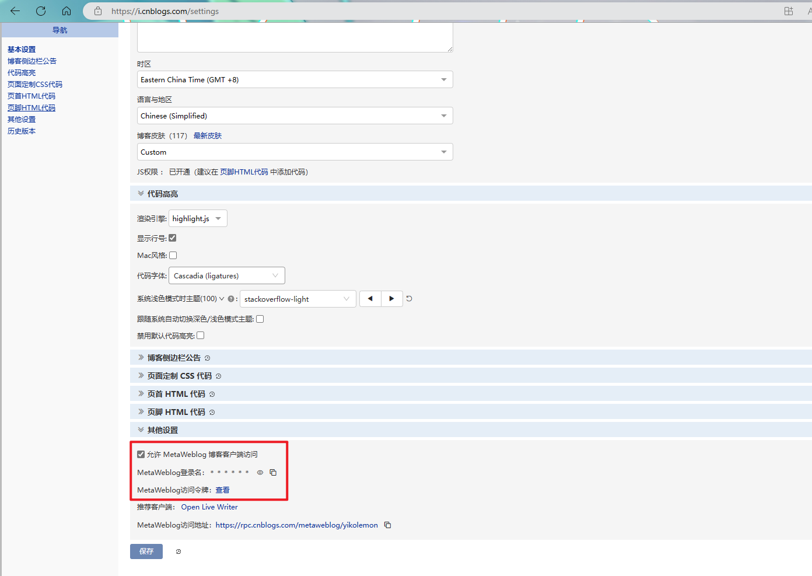

本人花了一个月时间，正在搭建一个能够实时同步博客园文章的博客后台。无奈突然得到了博客园最后破釜沉舟的消息。

故花了一天时间快速搭建了这个**博客园Markdown文章快速备份工具**

目前工具已成功运行 ,你只需要在博客园中获取你的metaweblog的**url**,**name**,**token**即可使用本工具

## 此工具需要Java环境

# 使用教程
1.下载release文件，解压jar并将其与application.properties放置同一路径下

2.登录博客园，获取自己的metaweblog参数,写入application.properties

地址:https://i.cnblogs.com/settings

(可选)修改博客文件存储路径,默认存储在C盘blogBackUp目录下,**文件存储路径格式参照application.properties**

3.在程序路径下运行cmd,输入java -jar cnblogs-shell-backup-util 1.0.0.jar执行程序

4.按照程序提示,在弹出的浏览器窗口中登录自己的博客园账号,复制code到窗口,回车等待博客备份成功
